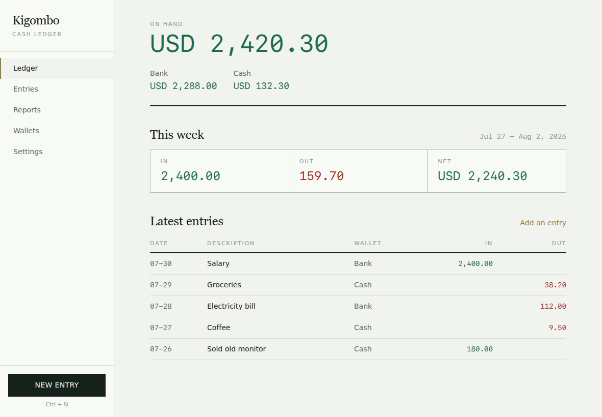
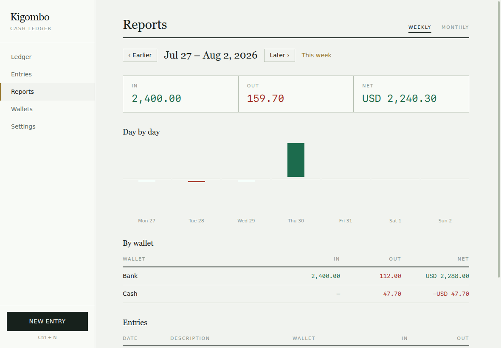

# Kigombo

A personal cash ledger for the desktop. Two things go in it — money in and money
out — each with a description, a date, and a wallet. It answers one question:
where did the money go this week, and this month.

Everything lives in a single SQLite file on your machine. No accounts, no sync,
no network calls.



## Features

- Money in and money out, each with a description and an editable date
- Multiple wallets — cash, bank, whatever you keep money in
- Weekly reports: day-by-day totals, per-wallet breakdown, the week's entries
- Monthly reports: week-by-week totals and a comparison against last month
- Filter and search every entry; edit or delete any of them
- Any currency; weeks start Monday or Sunday, your choice
- Follows your system light/dark theme



## Install on Linux

Needs Node 20+, npm, git, and a C toolchain (`build-essential` on Debian/Ubuntu,
`base-devel` on Arch) so the SQLite driver can compile.

```sh
git clone https://github.com/ahmad1284/kigombo-electron.git
cd kigombo-electron
./scripts/install-linux.sh
```

That builds an AppImage, drops it in `~/Applications/Kigombo.AppImage`, and adds
a menu entry — Kigombo then shows up in your app launcher like any other app. No
root required.

Prefer to do it by hand, or just run it once?

```sh
npm install
npm run package                      # -> dist/Kigombo-<version>.AppImage
chmod +x dist/Kigombo-*.AppImage
./dist/Kigombo-*.AppImage            # double-clickable, too
```

### If the app won't start under `npm run dev`

Chromium's sandbox helper needs root ownership. This affects development runs
only — the AppImage handles it itself.

```sh
sudo chown root:root node_modules/electron/dist/chrome-sandbox
sudo chmod 4755 node_modules/electron/dist/chrome-sandbox
```

## Develop

```sh
npm run dev        # hot reload
npm run typecheck  # both tsconfig projects
npm run test       # unit tests: ledger math, week bucketing, money parsing
npm run test:e2e   # builds, then drives the real app with Playwright
```

The E2E suite launches the packaged main process against a throwaway database
(via the `KIGOMBO_USER_DATA` environment variable), so your own ledger is never
touched.

## How it is put together

Electron + React + TypeScript, SQLite through `better-sqlite3` in the main
process. The renderer never touches the filesystem.

| Path                   | Role                                                              |
| ---------------------- | ----------------------------------------------------------------- |
| `src/main/db.ts`       | Opens SQLite, runs migrations, seeds a `Cash` wallet and defaults. |
| `src/main/repo/`       | All SQL. Pure functions over a database handle, unit-tested.       |
| `src/main/ipc.ts`      | One handler per operation; every payload is zod-checked.           |
| `src/preload/index.ts` | The only bridge — exposes `window.api`, never `ipcRenderer`.       |
| `src/renderer/`        | React UI. No business logic; totals come from the repo layer.      |
| `src/shared/`          | Types and date math used by both sides.                            |

Two rules keep the money honest:

- **Amounts are integer minor units.** Floats never touch a balance. Conversion
  happens only at the input field and the rendered string (`lib/money.ts`).
- **Wallets are archived, never deleted.** Past entries keep a valid wallet, so
  a report from last March still reads the same next year.

## Where your data is

`~/.config/Kigombo/kigombo.db` on Linux. The exact path is shown under Settings,
with a button to open it in your file manager. Copy that file to back up; delete
it to start over.

## License

MIT
